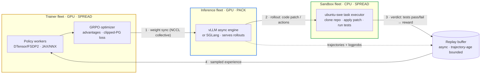

<div align="center">

# dockyard_rl: Distributed RL Post-Training for Project Dockyard


[Documentation](https://nullvoider07.github.io/dockyard_rl/) · [Architecture](https://nullvoider07.github.io/dockyard_rl/architecture/overview.html) · [Design docs](https://nullvoider07.github.io/dockyard_rl/design-docs/index.html) · [Environments](https://nullvoider07.github.io/dockyard_rl/environments/index.html)

</div>

## Overview

dockyard_rl is a scalable, asynchronous reinforcement-learning post-training
system for large language models, built on Ray. It is purpose-built for
**execution-grounded RL**: agents act (emit a code patch, drive a terminal,
operate a desktop), a sandbox runs the result, and the real verdict — tests
passing, a program rebuilding, a file produced — is the reward. No learned reward
model sits in the critical path.

<!-- Rendered by GitHub. The numbered edges trace one async GRPO cycle. -->



The system runs as **three asynchronous fleets** — a trainer, a generation
engine, and a sandbox — that run concurrently and never block one another. The
trainer optimizes the policy, the inference fleet generates rollouts, and the
sandbox scores them; weights flow trainer→inference and experience flows back,
over dedicated transports rather than a shared process.

What you can expect:

- **Execution-grounded rewards** — rewards come from running code in an isolated
  `ubuntu-swe` sandbox, hardened against reward hacking (held-out tests are
  force-restored and tampering is penalized).
- **Asynchronous, non-colocated training** — a replay buffer decouples generation
  from optimization, with in-flight weight updates and importance-sampling
  correction for the resulting staleness.
- **Two trainer backends, one interface** — PyTorch DTensor/FSDP2 (Distributed
  Tensors + Fully Sharded Data Parallel v2) and an optional JAX (Flax NNX)
  backend sit below the same policy interface; the inference fleet is unchanged
  either way.
- **Scale with Ray** — fleet-aware placement (`SPREAD`/`PACK`/`STRICT_PACK`),
  tensor / context / expert parallelism, sequence packing, and dynamic batching.
- **Beyond code** — multi-turn terminal agents, cleanroom program reconstruction,
  file-producing tasks, and full GUI computer-use (multimodal).

See the [design docs](https://nullvoider07.github.io/dockyard_rl/design-docs/index.html) for the architecture and the
reasoning behind each subsystem.

### Training backends

The trainer backend is selected from the YAML config; both implement the same
`models/policy/interfaces.py` ABCs, so everything above the policy is identical.

- **DTensor / FSDP2** (default) — PyTorch-native FSDP2 with tensor, context, and
  expert parallelism. Selected by `policy.dtensor_cfg.enabled`.
- **JAX / Flax NNX** — `jax.sharding` (GSPMD, XLA's automatic sharding) + optax,
  with Hugging Face (HF) weight parity and the same refit name-map. Selected by
  `policy.jax_cfg.enabled`. See
  [the JAX trainer design doc](https://nullvoider07.github.io/dockyard_rl/design-docs/jax-trainer.html).

### Generation backends

- **vLLM** — high-throughput async engine; the default. Supports in-flight weight
  updates and optional FP8 (8-bit float) serving (weights quantized from bf16 /
  bfloat16 on each refit).
- **SGLang** — alternative rollout backend (colocated topologies).

## Features

✅ _available now_ · 🔜 _planned_

- ✅ **Asynchronous GRPO (Group Relative Policy Optimization)** — replay buffer,
  trajectory-age bounding, in-flight weight updates, importance-sampling
  correction; synchronous GRPO also supported.
- ✅ **Execution-grounded rewards + integrity** — pytest verdicts via the sandbox,
  with the anti-reward-hacking (held-out-test) path.
- ✅ **Multi-environment training** — SWE-bench (Software Engineering benchmark) /
  SWE-bench Pro, ProgramBench, Terminal-Bench, OSWorld (computer-use), GDPval,
  HLE (Humanity's Last Exam), math.
- ✅ **Multi-turn agentic rollouts** — long-lived sandbox sessions (terminal,
  cleanroom reconstruction, file-producing deliverables).
- ✅ **Computer-use agent (CUA)** — multimodal GUI control across Linux / Windows /
  macOS guest backends.
- ✅ **Two trainer backends** — DTensor/FSDP2 and JAX/Flax NNX below one interface.
- ✅ **Mixture-of-Experts (MoE)** — expert parallelism, grouped-GEMM (General
  Matrix Multiply) experts, and aux-loss-free load balancing.
- ✅ **Hybrid linear attention** — Gated-DeltaNet (Qwen3-Next lineage) on the JAX
  backend.
- ✅ **Advanced parallelism** — tensor / context / expert parallel, sequence
  packing, dynamic batching, activation checkpointing, LoRA (Low-Rank Adaptation).
- ✅ **FP8 inference serving** — block-wise FP8 vLLM generation quantized on refit
  (training stays bf16), including the per-expert MoE path.
- ✅ **Structured tool use** — native Hermes `<tool_call>` protocol with RL-safe
  grammar constraining and schema-validated invalid-action penalties.
- ✅ **Weight-sync transports** — NCCL (NVIDIA Collective Communications Library)
  collective (non-colocated), IPC/ZMQ, HTTP.
- ✅ **Non-colocated data plane** — experience transfer without a driver round-trip.
- ✅ **Algorithms** — GRPO / GSPO (Group Sequence PO) / DAPO (Decoupled-clip
  Dynamic-sAmpling PO) as one configurable clipped policy-gradient (PG) loss,
  plus DPO (Direct Preference Optimization), online DPO, SFT (Supervised
  Fine-Tuning), on-policy distillation, reward modeling, and RLAIF (RL from AI
  Feedback).
- ✅ **Deployment** — Slurm (`ray.sub`) and Kubernetes (`infra/dockyard_k8s`).
- ✅ **Kubernetes production hardening** — the launcher is in active development.
- 🔜 **JAX backend at GPU scale** — multi-GPU sharded training and live NCCL refit
  (CPU-validated today; hardware bring-up tracked in the HV ledger).
- 🔜 **Marquee model targets** — Gemma-class and Nex-N2 trainer paths.

## Table of contents

- [Prerequisites](#prerequisites)
- [Quick start](#quick-start)
- [Support matrix](#support-matrix)
- [GRPO](#grpo)
  - [Single node](#single-node)
  - [Multi-node](#multi-node)
  - [Switching environments](#switching-environments)
- [Other algorithms](#other-algorithms)
- [Configuration](#configuration)
- [Deployment](#deployment)
- [Repository layout](#repository-layout)
- [Validation](#validation)
- [Documentation](#documentation)
- [Acknowledgements](#acknowledgements)
- [Citation](#citation)
- [License](#license)

## Prerequisites

dockyard_rl runs from the `ubuntu-swe` container image, which **bakes every
runtime dependency into the system Python**. There is no `uv` and no virtualenv
at runtime — Ray actors use `sys.executable`, and `RAY_ENABLE_UV_RUN_RUNTIME_ENV=0`
disables Ray's `uv` integration. (Build-time `uv` is used inside the image build.)

Build the image (default backend):

```sh
cd ubuntu-base
docker build -f ubuntu-swe-v2.dockerfile -t ubuntu-swe:v2 .
```

The Dockerfile runs in-build `import jax` / `import vllm` smoke checks, so a
broken dependency graph fails the build. SGLang and GDPval image variants are
also provided (`ubuntu-swe-sglang.dockerfile`, `ubuntu-swe-gdpval.dockerfile`).

For local development (editing, type-checking, the CPU unit suite) only the
package and a CPU stack are needed:

```sh
pip install -e .          # lightweight local-dev deps; GPU stack comes from the image
```

See the [installation guide](https://nullvoider07.github.io/dockyard_rl/getting-started/installation.html)
for the full runtime model and environment variables.

## Quick start

A cluster needs the three fleets (each declaring `DOCKYARD_FLEET_ROLE`) and at
least one sandbox task executor reachable at `env.code.sandbox_urls`
(default `http://localhost:9090`). Then launch SWE-bench GRPO:

```sh
python3 examples/run_grpo_swe.py \
    --config examples/configs/grpo_swe.yaml \
    cluster.gpus_per_node=8 \
    cluster.num_nodes=4 \
    policy.model_name=Qwen/Qwen2.5-7B-Instruct
```

Everything after `--config` is a Hydra-style dot-notation override. The
[quickstart guide](https://nullvoider07.github.io/dockyard_rl/getting-started/quickstart.html) walks through each stage of
what launches.

## Support matrix

| Capability | Status |
| --- | --- |
| **Algorithms** | GRPO (sync + async), DPO, online DPO, SFT, on-policy distillation, reward modeling, RLAIF |
| **Advantage estimators** | GRPO (leave-one-out), GDPO (multi-reward GRPO), Reinforce++ |
| **Trainer backends** | DTensor/FSDP2, JAX/Flax NNX |
| **Generation backends** | vLLM (async, FP8-capable), SGLang |
| **Environments** | SWE-bench / Pro, ProgramBench, Terminal-Bench, OSWorld (CUA), GDPval, HLE, math |
| **Parallelism** | TP, CP, EP (+ sequence packing, dynamic batching, LoRA) |
| **Deployment** | Slurm (`ray.sub`), Kubernetes (`infra/dockyard_k8s`) |

The runnable entry point is GRPO (`examples/run_grpo_swe.py`) driving the
`grpo_*.yaml` config family; the other algorithms are implemented in
`algorithms/` on the shared policy/loss stack.

## GRPO

GRPO replaces the value network of PPO (Proximal Policy Optimization) with a
group-relative baseline: several rollouts are sampled per prompt, and each
rollout's advantage is its reward minus the group mean (leave-one-out). The
design is detailed in
[the GRPO and loss design doc](https://nullvoider07.github.io/dockyard_rl/design-docs/grpo-and-loss.html).

### Single node

Run SWE-bench GRPO on the GPUs of one node:

```sh
python3 examples/run_grpo_swe.py \
    --config examples/configs/grpo_swe.yaml \
    cluster.num_nodes=1 \
    cluster.gpus_per_node=8
```

Override any key from the YAML on the command line, e.g.:

```sh
python3 examples/run_grpo_swe.py \
    --config examples/configs/grpo_swe.yaml \
    policy.model_name=Qwen/Qwen2.5-14B-Instruct \
    grpo.num_prompts_per_step=32 \
    loss_fn.reference_policy_kl_penalty=0.02 \
    logger.wandb_enabled=true \
    logger.wandb.name=grpo-swe-14b
```

### Multi-node

On Slurm, `ray.sub` brings up the Ray cluster inside the `ubuntu-swe` image and
runs the training command (note: `python3`, not `uv run` — deps are baked in):

```sh
# From the repository root.
CONTAINER=<your-registry>/ubuntu-swe:v2 \
MOUNTS="$PWD:$PWD" \
COMMAND="python3 examples/run_grpo_swe.py --config examples/configs/grpo_swe.yaml cluster.num_nodes=4 checkpointing.checkpoint_dir='results/grpo-swe' logger.wandb_enabled=true logger.wandb.name='grpo-swe'" \
sbatch \
    --nodes=4 \
    --account=YOUR_ACCOUNT \
    --job-name=YOUR_JOBNAME \
    --partition=YOUR_PARTITION \
    --time=4:0:0 \
    --gres=gpu:8 \
    ray.sub
```

Each node declares its `DOCKYARD_FLEET_ROLE`; see
[the Slurm deployment guide](https://nullvoider07.github.io/dockyard_rl/deployment/slurm.html) (and `scripts/cluster/` for
non-Slurm bare metal).

### Switching environments

The same launcher trains any environment — the config selects the dataset,
environment, and rollout shape:

| Config | Environment |
| --- | --- |
| `grpo_swe.yaml` / `grpo_swe_pro.yaml` | SWE-bench / SWE-bench Pro coding agent |
| `grpo_swe_sglang.yaml` | SWE-bench on the SGLang backend |
| `grpo_swe_jax.yaml` | SWE-bench on the JAX trainer backend |
| `grpo_program_bench.yaml` | ProgramBench cleanroom reconstruction |
| `grpo_terminal_bench.yaml` | Terminal-Bench agentic tasks |
| `grpo_osworld.yaml` | OSWorld computer-use agent |
| `grpo_gdpval.yaml` / `grpo_gdpval_agentic.yaml` | GDPval deliverables |
| `grpo_hle.yaml` | Humanity's Last Exam |

```sh
python3 examples/run_grpo_swe.py --config examples/configs/grpo_osworld.yaml
```

Per-environment details (scoring, integrity, provisioning) are in
[the environments docs](https://nullvoider07.github.io/dockyard_rl/environments/index.html).

## Other algorithms

Beyond GRPO, each algorithm has its own launcher and config (same override
system; configs ship small single-GPU defaults but expose the full parallelism
surface):

```sh
python3 examples/run_sft.py          --config examples/configs/sft.yaml
python3 examples/run_dpo.py          --config examples/configs/dpo.yaml
python3 examples/run_rm.py           --config examples/configs/rm.yaml
python3 examples/run_distillation.py --config examples/configs/distillation.yaml
python3 examples/run_online_dpo.py   --config examples/configs/online_dpo.yaml
python3 examples/run_rlaif.py        --config examples/configs/rlaif.yaml
```

- **SFT** (`algorithms/sft.py`) — supervised fine-tuning (masked NLL), with LoRA.
- **DPO** (`algorithms/dpo.py`) — preference optimization with the configurable
  `DPOLossFn` (DPO/IPO/cDPO/DPOP/R-DPO via one parameterized core, optional
  SFT-blend and reference-free SimPO/ORPO modes). See
  [the DPO design doc](https://nullvoider07.github.io/dockyard_rl/design-docs/dpo.html).
- **Reward modeling** (`algorithms/rm.py`) — scalar RM on preference pairs
  (Bradley-Terry loss).
- **On-policy distillation** (`algorithms/distillation.py`) — the student
  generates against an environment; a frozen teacher supplies top-k logits.
- **Online DPO** (`algorithms/online_dpo.py`) — on-policy: generate K candidates,
  judge them, train on best-vs-worst pairs.
- **RLAIF / Constitutional-AI** (`algorithms/rlaif.py`) — critique→revise to build
  preference pairs without human labels, then a DPO step.

## Evaluation

```sh
python3 examples/run_eval.py --config examples/configs/eval.yaml
```

Standalone evaluation reuses the GRPO setup + `validate()` path: generation on a
held-out set scored by a verifier environment (the example uses the `math` env —
an in-process verifier, no sandbox). Two data modes:

- **Eval-dataset mode** — an `eval` block loads a benchmark from the eval-dataset
  registry (`math`/MATH-500, `aime`, `gpqa`, `mmlu`, `mmlu_pro`, `mmau`,
  `local_math`); the ground-truth answer is threaded onto each sample for the
  verifier.
- **Response/env mode** — without an `eval` block, a response dataset + env is
  built the same way GRPO training builds its validation set.

Math benchmarks score with the `math` env's default verifier. Multiple-choice
benchmarks (`gpqa`/`mmlu`/`mmlu_pro`/`mmau`) use the `english_multichoice`
verifier, which extracts an `Answer: X` line and compares the letter to the gold
label; the run's system prompt must force that output format. Ready-to-run
configs ship for both:

```sh
python3 examples/run_eval.py --config examples/configs/gpqa.yaml
python3 examples/run_eval.py --config examples/configs/mmlu.yaml
```

## Configuration

Configuration is YAML resolved by OmegaConf with Hydra-style overrides, validated
into a Pydantic `MasterConfig`. The top-level sections are `policy`, `loss_fn`,
`grpo`, `env`, `data`, `cluster`, `logger`, `checkpointing`, and an optional
`data_plane`. The full model — every section and the key knobs — is documented in
[the configuration guide](https://nullvoider07.github.io/dockyard_rl/getting-started/configuration.html).

## Deployment

- **Slurm** — `ray.sub` + `scripts/cluster/`. See
  [the Slurm deployment guide](https://nullvoider07.github.io/dockyard_rl/deployment/slurm.html).
- **Kubernetes** — `infra/dockyard_k8s`, a config-driven launcher that renders the
  sandbox `Deployment`/`Service` and a `RayJob`/`RayCluster` from a recipe + infra
  spec (in active development). Sandbox pods ship hardened by default
  (securityContext, NetworkPolicy, PodDisruptionBudget, right-sized requests vs.
  burst limits), with opt-in `priorityClassName` / `ResourceQuota` / `LimitRange`
  and offline `kubeconform` validation; see
  [`infra/README.md`](infra/README.md#production-hardening). Full guide:
  [the Kubernetes deployment guide](https://nullvoider07.github.io/dockyard_rl/deployment/kubernetes.html).

## Repository layout

| Path | Contents |
| --- | --- |
| `algorithms/` | GRPO, DPO, SFT, distillation, RM, loss functions, advantage estimators. |
| `models/` | Generation (`generation/`: vLLM, SGLang) and policy backends (`dtensor/`, `jax/`). |
| `distributed/` | Virtual cluster, worker groups, batched data containers, sharding. |
| `cluster/` | Ray bootstrap, fleet management, placement, NCCL weight sync. |
| `data/` | Datasets, processors, registries, packing. |
| `environments/` | Task environments and their scoring. |
| `rewards/` | Reward computation and the integrity (anti-reward-hacking) path. |
| `sandbox/` | Client for the `ubuntu-swe` task executor. |
| `ubuntu-base/` | The `ubuntu-swe` image and `task_executor.py`. |
| `weight_sync/` | Weight-sync transports (NCCL / IPC / HTTP). |
| `data_plane/` | Non-colocated experience-transfer plane. |
| `tool_protocol/` | Structured (Hermes) tool-use protocol primitives. |
| `experience/` | Rollout collection, including the computer-use agent (`cua/`). |
| `modelopt/` | FP8 weight quantization for inference serving. |
| `infra/` | Kubernetes deployment assets; `ray.sub` / `scripts/cluster/` cover Slurm. |
| `examples/` | The launcher (`run_grpo_swe.py`) and the `configs/` family. |
| `docs/` | Sphinx documentation sources (published at the Pages site). |

## Validation

**Validation is incomplete.** There are no GPU/cluster resources at the
developer's end, so the parts of the system that need real hardware have not yet
been run — that validation is **pending**. What can be checked on CPU is the
standing test gate:

```sh
pytest tests/unit -q          # CPU-only unit + parity suite
cd .. && pyright dockyard_rl  # canonical type check (run from the parent dir)
```

The `ubuntu-swe` image is validated by `docker build` (the in-build `import jax`
/ `import vllm` checks gate dependency breakage).

Behaviour that **can only be confirmed on real hardware** — live NCCL/collective
numerics, multi-GPU sharding, CUDA-only kernels, bf16 numerics, weight refit into
a running inference engine, end-to-end convergence, and Kubernetes policy
enforcement (NetworkPolicy/PDB/securityContext under a live cluster) — is
therefore **written but not yet verified**. Every such item is logged, with its exact unverified
assumption and the check that would close it on hardware, in
[`hardware-deferred-validation.md`](hardware-deferred-validation.md). These
validations are pending, not presumed complete: until each check is run on a GPU
it should be treated as unproven. If you have GPU/cluster resources and run any of
them, results (pass or fail) are welcome via an issue or PR referencing the `HV-`
id.

## Documentation

The full documentation is published at
**<https://nullvoider07.github.io/dockyard_rl/>** — getting started, the runtime
architecture, per-subsystem design docs, every environment, deployment, and an
auto-generated API reference.

To build the Sphinx site locally from the `docs/` sources:

```sh
pip install -r docs/requirements.txt
cd docs && make html      # open _build/html/index.html
```

New to the acronyms (GRPO, DAPO, GDPO, FSDP2, NCCL, RoCE, …)? The
[glossary](https://nullvoider07.github.io/dockyard_rl/glossary.html) expands them
with one-line definitions.

## Acknowledgements

dockyard_rl was developed with reference to **NVIDIA's NeMo-RL** post-training
library. NeMo-RL was used as a design and implementation reference throughout
the development and ongoing evolution of this project — informing the
distributed-RL architecture, the GRPO / clipped-policy-gradient formulation, and
the Ray-based fleet orchestration, among other areas. dockyard_rl is an
independent, standalone system with its own architecture, and runtime
model rather than a fork, but its lineage traces to NeMo-RL and I gratefully
acknowledge its authors and NVIDIA. NeMo-RL is distributed under the Apache
License 2.0; see the [`NOTICE`](NOTICE) file for attribution details.

## Citation

```bibtex
@misc{dockyard_rl,
  title  = {dockyard_rl: Distributed RL Post-Training for Project Dockyard},
  author = {Kartik A (NullVoider)},
  year   = {2026},
  note   = {Internal repository},
}
```

## License

dockyard_rl is licensed under the [Apache License 2.0](LICENSE).
