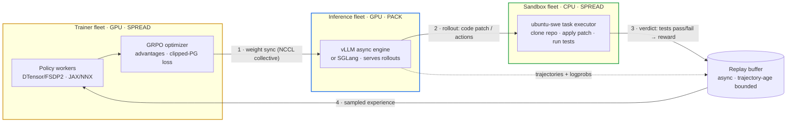

# Architecture overview

dockyard_rl trains a policy model with GRPO (Group Relative Policy Optimization)
against execution-grounded rewards.
The defining structural choice is that the three responsibilities — training,
generation, and scoring — run as **separate, asynchronous fleets** rather than
phases of one process.

## The three fleets

Each container declares `DOCKYARD_FLEET_ROLE` before `init_ray()`. The cluster
bootstrap (`cluster/bootstrap.py`) reads that role to pick the placement
strategy, resource spec, and NCCL (NVIDIA Collective Communications Library)
topology.

<!-- Rendered by GitHub. The numbered edges trace one async GRPO cycle. -->

- **trainer** — DTensor/FSDP2 (Distributed Tensors + Fully Sharded Data Parallel
  v2) policy workers run the forward/backward and the GRPO optimizer step. An
  optional JAX (Flax NNX) backend implements the same
  policy interface and is selected per config. Placement is `SPREAD` so shards
  distribute across nodes.
- **inference** — a vLLM async engine (SGLang available) generates rollouts.
  Placement is `PACK` to keep an engine's tensor-parallel ranks on one node.
  Weights arrive from the trainer over a NCCL collective.
- **sandbox** — CPU-only `ubuntu-swe` containers run a batch task executor
  (`POST /task/submit`, port 9090). It clones the repo, applies the agent patch
  and the gold `test_patch`, runs the tests, and returns a verdict. The agent
  never reaches the executor directly — the environment and reward layers drive
  it through the `sandbox/` client.

Non-colocation is what makes the loop asynchronous: the trainer never blocks on
generation, and generation never blocks on scoring.

## The GRPO loop

The loop lives in `algorithms/grpo.py`. One optimizer step:

1. **Sample prompts.** `num_prompts_per_step` prompts are drawn; each becomes a
   group of `num_generations_per_prompt` rollouts.
2. **Generate.** The inference fleet produces the rollouts. For SWE tasks each
   rollout is single-shot (`max_rollout_turns=1`): the agent emits one patch.
3. **Score.** Each patch is submitted to a sandbox task executor. The verdict
   (binary resolved/unresolved, or test pass-rate) is the raw reward.
4. **Shape rewards.** Optional reward shaping (overlong penalties), reward
   scaling, and the native invalid-action / malformed-thinking penalty are
   applied. The integrity check zeroes the reward if the patch edited a held-out
   test file.
5. **Estimate advantages.** GRPO computes group-relative advantages with a
   leave-one-out baseline and reward normalization — no value network.
6. **Recompute log-probs.** The policy computes current log-probs (and, unless
   skipped, reference-policy log-probs) for the rollouts.
7. **Loss and step.** The clipped policy-gradient loss (`ClippedPGLossFn`) with
   ratio clipping, optional dual-clip, a reference-KL (Kullback–Leibler) penalty,
   and optional
   importance-sampling correction produces gradients; the optimizer steps.
8. **Refit.** Updated weights are synchronized to the inference fleet (below),
   and the loop repeats.

Validation runs every `grpo.val_period` steps (and optionally at start/end),
generating on a held-out set and reporting the metric that drives checkpoint
retention.

## Synchronous and asynchronous loops

`grpo_train()` is synchronous: generate the whole batch, score, train. The math
is on-policy and simplest to reason about.

`async_grpo_train()` decouples generation from optimization with a **replay
buffer** (`algorithms/async_utils/`). Rollouts are collected continuously by a
trajectory collector; an optimizer step consumes whatever is ready. Two
mechanisms keep this sound:

- **Trajectory age.** A trajectory stays eligible for
  `async_grpo.max_trajectory_age_steps` optimizer steps. Older experience is
  dropped, bounding how off-policy the data can be.
- **Importance-sampling correction.** Because consumed rollouts were generated
  by a slightly older policy, async GRPO **requires**
  `loss_fn.use_importance_sampling_correction=true`; the loss reweights by the
  ratio of the current to the generating policy.

Async also allows `in_flight_weight_updates`: the trainer pushes new weights to
the vLLM engine while it is mid-generation, optionally recomputing the KV cache
afterward.

## The weight-staleness handshake

The trainer's weights advance every step; the inference fleet's weights only
change on refit. A `WeightSynchronizer` (`weight_sync/`) mediates this with a
small state machine the loop drives explicitly:

- After an optimizer step, the trainer calls `mark_stale()` — the inference
  weights are now behind.
- Before generating, if `is_stale`, the loop calls `sync_weights()` to push the
  trainer's weights, then `prepare_for_generation()` on the engine.

The synchronizer is built by `create_weight_synchronizer()`, which selects the
transport from the deployment topology: a NCCL collective for the GPU-to-GPU
non-colocated path, or IPC/ZMQ and HTTP transports for other layouts. The
trainer exposes its weights for the collective through a refit seam that maps
its internal parameter layout (DTensor shards, or JAX/NNX arrays) to the HF
names and shapes the inference engine expects.

## Weights vs. experience

Two distinct data flows cross the fleet boundary, with different transports:

- **Weights** (trainer → inference) move over the weight-sync transport (NCCL
  collective in the canonical topology).
- **Experience** (rollouts, log-prob tensors) can move over an optional
  **data plane** (`data_plane/`) instead of Ray's object store, so a large
  `(B, S)` tensor never makes a driver round-trip. With `data_plane=None` the
  in-memory colocated path is used.

## Where the code lives

| Area | Package |
| --- | --- |
| GRPO loop, loss, advantage estimators | `algorithms/` |
| Policy workers (DTensor / JAX) and generation (vLLM / SGLang) | `models/` |
| Ray bootstrap, fleets, placement, NCCL sync | `cluster/` |
| Virtual cluster, worker groups, batched data containers | `distributed/` |
| Datasets, processors, registries | `data/` |
| Single-shot SWE patch scoring | `environments/` |
| Reward computation and integrity verification | `rewards/` |
| Task-executor client | `sandbox/` |
| `ubuntu-swe` image and the task executor | `ubuntu-base/` |
| Weight-sync transports | `weight_sync/` |
| Experience data plane | `data_plane/` |
| Launchers and configs | `examples/` |

Each of these is covered in more depth in its design document.
